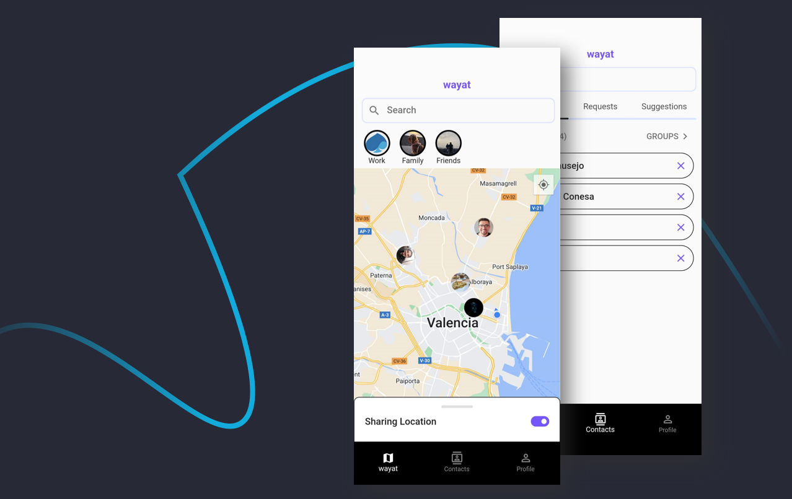

<link href='https://fonts.googleapis.com/css?family=Roboto' rel='stylesheet'>

 

   

  

## Table of contents

- [What is WAYAT?](#what-is-wayat)
- [What is WAYAT for?](#what-is-wayat-for)
- [Features](#features)
- [For developers](#for-developers)

# What is WAYAT?

What is WAYAT? It stands for Where Are You AT, and it's a mobile app which allows people to publish their current location.

It is made with Flutter, which  provides:
- **Multiplatform** applications (mobile, web, Desktop)
- Very **short time to market**
- Great integration with **Google Cloud**

In this App people should be able to connect to “buddies” so they can connect to a network of people which shares each other's locations.

You can download the Android apk in [here](https://github.com/devonfw-forge/wayat-flutter-python-mvp/releases/latest) or access the web if you are registered by this [link](https://wayat-web-dchj7vzxga-no.a.run.app/)

# What is WAYAT for?

There are many use cases for WAYAT. This are just a few examples. Do any of them sound familiar?

- **As a Person working in hybrid mode** from Home or at the office I would
like to obtain easily the location of my “buddies” so I can determine which one I can
meet in person or where I have to go.

- **As a Person travelling alone** I would like to obtain easily the planned location of my
“buddies” so I plan where to meet them.

Check our releases if you want to start now! You just need a Google Account and automatically all your selected contacts in your addressbook that has registered to WAYAT will be able to find your location and viceversa.

# Features
- See all your contacts wherever they are.
- Login using google account and phone verification.
- Add a photo to your profile and change your username.
- Searchbar to easily find your friends in the map or in the addresbook of wayat.
- Groups filter, which allows to filter your contacts location by for example coworkers, friends, family...
- Add a photo to a group and add and remove friends from this with a simple tap.
- Get users available in wayat automatically from your addressbook
- Send and receive friend requests.
- Receive push and in-app notifications.
- It supports:
  - English
  - Spanish
  - French
  - German
  - Dutch
- Log out the application or remove your account whenever you want.
- Stop sharing location with all contacts or decide which one will receive your location just by tapping a switch.

# For developers
There is some extra information to those who wants to check how to deploy the flutter application or check how the backend is working. Just check the next links:

- [Frontend Documentation](https://github.com/devonfw-forge/wayat-flutter-python-mvp/tree/main/wayat/frontend#readme)
- [Backend Documentation](https://github.com/devonfw-forge/wayat-flutter-python-mvp/tree/main/wayat/backend#readme)
